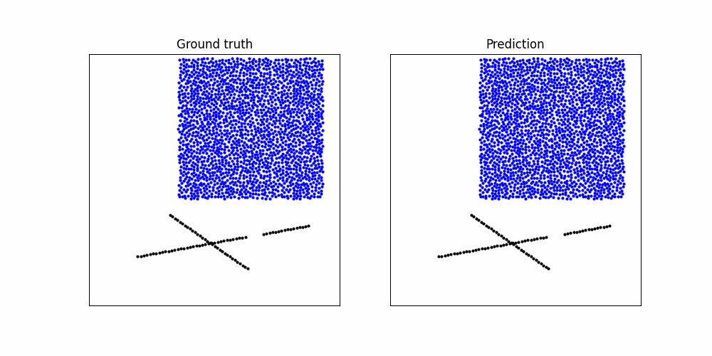
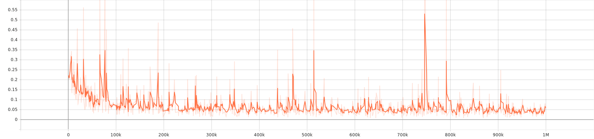

# GNNforPhysics
Graph Neural Networks for Physics

fork from https://github.com/deepmind/deepmind-research/tree/master/learning_to_simulate

``` bash
# Download dataset (e.g. WaterRamps):
bash ./learning_to_simulate/download_dataset.sh WaterDrop ./tmp/datasets
```

{DATASET_NAME} one of the datasets following the naming used in the paper:
1. WaterDrop
1. Water
1. Sand
1. Goop
1. MultiMaterial
1. RandomFloor
1. WaterRamps
1. SandRamps
1. FluidShake
1. FluidShakeBox
1. Continuous
1. WaterDrop-XL
1. Water-3D
1. Sand-3D
1. Goop-3D

``` bash
# run jupyter in docker:
docker-compose up
```

``` bash
# Train a model:
# Generate some trajectory rollouts on the test set:
# Plot a trajectory:

# edit dcx/docker-compose.yaml
cd dc0
docker-compose up
```

``` bash
# Check model log by tensorboard:
tensorboard --logdir tmp/models
```

tensorboard image
- WaterRamps(1000000step)
    - Example
    
    - GRAPHS
    
    - SCALARS loss
    